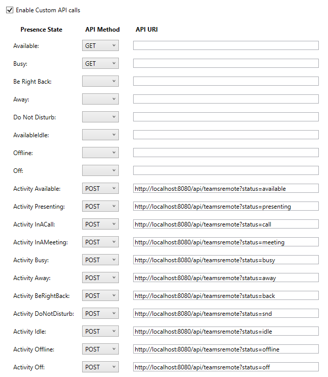
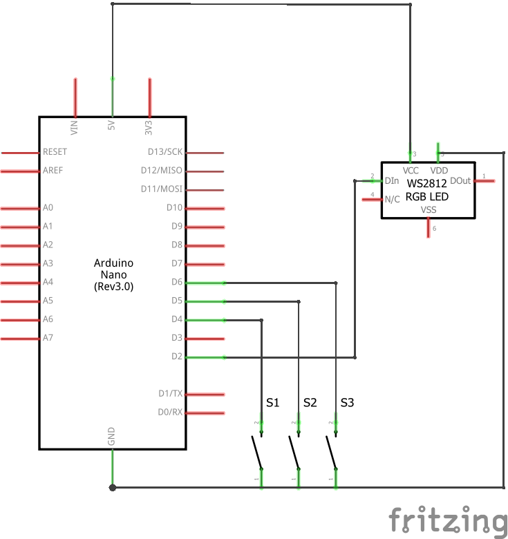

# Teams Remote
A remote control for Teams

It was hacked down in one evening... bare with me for some "spaghetti code" ;)

## Functions
* Send Hotkeys to the MS Teams App (even if it is in the background) using the GetWindow functions from user32.dll
* Raise/lower hand in a call
* Mute/unmute mic in a call
* Turn webacm on/off during a call
* Reflect the button presses with the lighting from inside the box (red=mic on, green=webcam on, yellow=hand raised)

## Instructions
* Install the needed Arduino librarys (Adafruit_NeoPixel, Bounce2)
* Compile and load the ino to your Arduino Nano
* Open the Visual Studio Solution (sln) install all nuget packages an run the thing on your PC...
* You can adjust the used COM Port in the settings.json
* If you want to detect an active call you can use the https://github.com/isaacrlevin/PresenceLight app
* Then you need to configure the custom API calls like below

## List of use material
* Arduino Nano
* 3 Buttons: https://www.amazon.de/gp/product/B077FH7TGD/ref=ppx_yo_dt_b_asin_title_o07_s00?ie=UTF8&psc=1
* 16 LEDs from a Strip with WS2812B like https://www.amazon.de/gp/product/B07TNPN4B6/ref=ppx_yo_dt_b_search_asin_title?ie=UTF8&th=1
* some cables for soldering

## Circuit Layout

